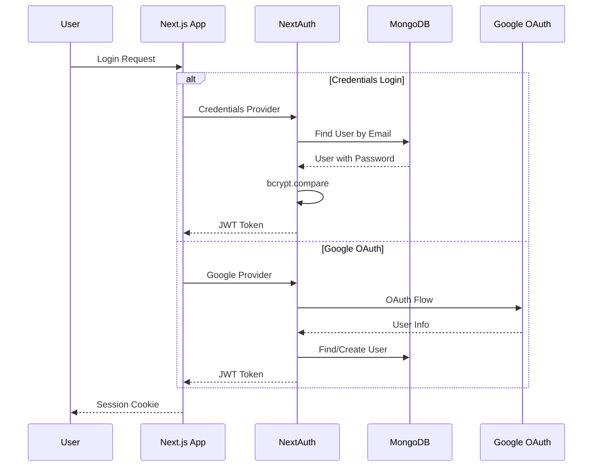
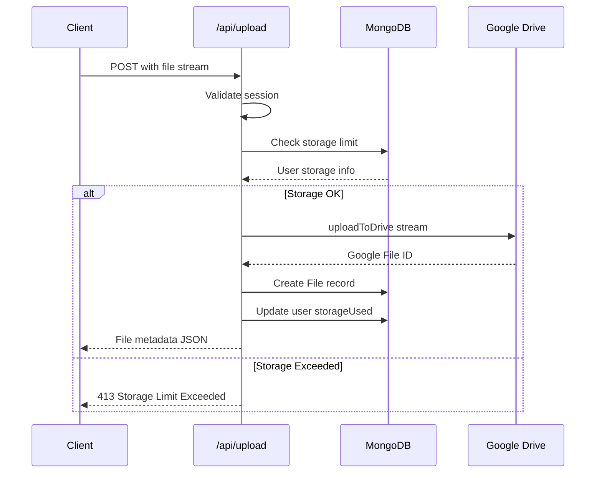

# DM-Drive Architecture Documentation

## Overview

DM-Drive is a cloud storage application built with **Next.js 14** that uses **Google Drive** as the backend storage provider and **MongoDB** for metadata management. It provides a Google Drive-like user experience with features including file/folder management, sharing, URL shortening, and admin capabilities.

---

## Technology Stack

| Layer | Technology |
|-------|------------|
| **Frontend** | Next.js 14 (App Router), React 18, TailwindCSS, Framer Motion |
| **Backend** | Next.js API Routes (Route Handlers) |
| **Database** | MongoDB with Mongoose ODM |
| **Storage** | Google Drive API v3 |
| **Authentication** | NextAuth.js (Google OAuth + Credentials) |
| **Deployment** | Vercel (standalone output) |

---

## System Architecture Diagram

```mermaid
flowchart TB
    subgraph Client[Client Layer]
        Browser[Web Browser]
        PWA[PWA Support]
    end

    subgraph NextJS[Next.js Application]
        subgraph Pages[App Router Pages]
            Auth[Auth Pages - login/register]
            Dashboard[Dashboard Pages]
            Share[Share Pages]
            Admin[Admin Panel]
            URL[URL Shortener]
        end

        subgraph API[API Routes]
            AuthAPI[/api/auth]
            FilesAPI[/api/files]
            FoldersAPI[/api/folders]
            UploadAPI[/api/upload]
            ShareAPI[/api/share]
            AdminAPI[/api/admin]
            URLAPI[/api/url]
        end

        subgraph Lib[Library Layer]
            DB[db.ts - MongoDB Connection]
            GDrive[google-drive.ts - Drive Client]
            Logger[logger.ts - File Logging]
        end
    end

    subgraph External[External Services]
        MongoDB[(MongoDB Atlas)]
        GoogleDrive[(Google Drive)]
        GoogleOAuth[Google OAuth]
    end

    Browser --> Pages
    Pages --> API
    API --> Lib
    DB --> MongoDB
    GDrive --> GoogleDrive
    AuthAPI --> GoogleOAuth
```

---

## Data Models

### User Model
```
User
├── name: String (required, max 60 chars)
├── email: String (required, unique)
├── password: String (select: false)
├── image: String
├── storageUsed: Number (default: 0)
├── storageLimit: Number (default: 5GB)
├── isAdmin: Boolean (default: false)
└── createdAt: Date
```

### File Model
```
File
├── name: String (required)
├── mimeType: String (required)
├── size: Number (required)
├── owner: ObjectId -> User (required)
├── parent: ObjectId -> Folder (nullable)
├── googleFileId: String (required)
├── isStarred: Boolean
├── isTrash: Boolean
├── sharedWith: Array of user/permission
├── publicToken: String (nullable)
├── sharePassword: String (hashed, nullable)
├── shareExpiry: Date (nullable)
└── createdAt: Date
```

### Folder Model
```
Folder
├── name: String (required)
├── owner: ObjectId -> User (required)
├── parent: ObjectId -> Folder (nullable = root)
├── color: String (default: #5f6368)
├── isTrash: Boolean
├── sharedWith: Array of user/permission
├── publicToken: String (nullable)
├── sharePassword: String (nullable)
├── shareExpiry: Date (nullable)
└── createdAt: Date
```

### URL Model
```
Url
├── shortCode: String (required, unique, indexed)
├── originalUrl: String (required)
├── clicks: Number (default: 0)
├── owner: ObjectId -> User (nullable)
└── createdAt: Date
```

---

## API Routes Structure

### Authentication
| Route | Method | Description |
|-------|--------|-------------|
| `/api/auth/[...nextauth]` | GET/POST | NextAuth.js handler |
| `/api/register` | POST | User registration |

### File Operations
| Route | Method | Description |
|-------|--------|-------------|
| `/api/files` | GET | List files with filters |
| `/api/file/[id]` | GET/DELETE/PATCH | Single file operations |
| `/api/file/[id]/thumbnail` | GET | Get file thumbnail |
| `/api/upload` | POST | Upload file to Google Drive |

### Folder Operations
| Route | Method | Description |
|-------|--------|-------------|
| `/api/folders` | GET/POST | List/create folders |
| `/api/folders/share` | POST | Share folder |

### Sharing
| Route | Method | Description |
|-------|--------|-------------|
| `/api/share` | POST | Create share link |
| `/api/share/verify` | POST | Verify share password |
| `/api/share/download` | GET | Download shared file |
| `/api/share/folder/verify` | POST | Verify folder share |
| `/api/share/folder/download` | GET | Download from shared folder |

### Admin
| Route | Method | Description |
|-------|--------|-------------|
| `/api/admin/verify` | GET | Verify admin status |
| `/api/admin/users` | GET | List all users |
| `/api/admin/users/[id]` | PATCH/DELETE | Manage user |
| `/api/admin/stats` | GET | System statistics |
| `/api/admin/logs` | GET | View system logs |

### URL Shortener
| Route | Method | Description |
|-------|--------|-------------|
| `/api/url` | GET/POST | List/create short URLs |
| `/api/url/[id]` | DELETE | Delete short URL |

### User Profile
| Route | Method | Description |
|-------|--------|-------------|
| `/api/user/profile` | GET/PATCH | User profile |
| `/api/user/password` | PATCH | Change password |
| `/api/user/stats` | GET | User storage stats |

### Trash
| Route | Method | Description |
|-------|--------|-------------|
| `/api/trash` | GET/DELETE | List/empty trash |

---

## Authentication Flow



---

## File Upload Flow



---

## Google Drive Integration

The application supports three authentication methods for Google Drive, prioritized as:

1. **OAuth2 Refresh Token** - For personal Google accounts with quota
2. **Service Account JSON File** - `service-account.json` in project root
3. **Service Account via Environment** - `GOOGLE_CLIENT_EMAIL` and `GOOGLE_PRIVATE_KEY`

### Key Functions in [`lib/google-drive.ts`](lib/google-drive.ts)
- [`uploadToDrive()`](lib/google-drive.ts:66) - Upload file stream to Drive
- [`getDriveAccessToken()`](lib/google-drive.ts:98) - Get access token for direct API calls
- [`deleteFromDrive()`](lib/google-drive.ts:111) - Delete file from Drive

---

## Frontend Pages Structure

```
app/
├── page.tsx                    # Landing page
├── layout.tsx                  # Root layout with Providers
├── providers.tsx               # SessionProvider wrapper
├── globals.css                 # TailwindCSS styles
│
├── (auth)/                     # Auth route group
│   ├── layout.tsx
│   ├── login/page.tsx
│   └── register/page.tsx
│
├── dashboard/                  # Main file browser
│   ├── page.tsx               # Root folder view
│   ├── recent/page.tsx        # Recent files
│   ├── starred/page.tsx       # Starred files
│   └── trash/page.tsx         # Trash view
│
├── admin/page.tsx             # Admin panel
├── settings/page.tsx          # User settings
│
├── share/                     # Public share pages
│   └── [token]/page.tsx       # File share view
│   └── folder/[token]/page.tsx # Folder share view
│
├── url/                       # URL shortener
│   ├── page.tsx               # URL management
│   └── [shortCode]/page.tsx   # Redirect handler
│
├── privacy/page.tsx           # Privacy policy
└── terms/page.tsx             # Terms of service
```

---

## Security Features

1. **Authentication**: JWT-based sessions via NextAuth.js
2. **Password Hashing**: bcryptjs for credential storage
3. **Storage Limits**: Per-user quota enforcement before upload
4. **Share Protection**: Optional password protection with expiry dates
5. **Admin Verification**: Separate admin check endpoint
6. **Input Sanitization**: Regex escaping for search queries to prevent ReDoS
7. **File Access Control**: Owner-based file access with sharing permissions

---

## Environment Variables Required

```env
# MongoDB
MONGODB_URI=

# NextAuth
NEXTAUTH_SECRET=
NEXTAUTH_URL=

# Google OAuth (for user login)
GOOGLE_CLIENT_ID=
GOOGLE_CLIENT_SECRET=

# Google Drive Storage (one of these methods)
# Method 1: OAuth2 Refresh Token
GOOGLE_REFRESH_TOKEN=

# Method 2: Service Account via env
GOOGLE_CLIENT_EMAIL=
GOOGLE_PRIVATE_KEY=

# Method 3: service-account.json file in root

# Google Drive folder for uploads
GOOGLE_DRIVE_ROOT_FOLDER_ID=
```

---

## Deployment Configuration

From [`next.config.js`](next.config.js):
- **Body Size Limit**: 50MB for server actions
- **Static Generation Timeout**: 180 seconds
- **Output Mode**: Standalone (optimized for Vercel/Docker)

---

## Utility Scripts

Located in [`scripts/`](scripts/):
- [`check-db.js`](scripts/check-db.js) - Database connectivity check
- [`exchange-token.js`](scripts/exchange-token.js) - OAuth token exchange
- [`get-google-token.js`](scripts/get-google-token.js) - Get Google tokens
- [`list-users.js`](scripts/list-users.js) - List all users
- [`make-admin.js`](scripts/make-admin.js) - Promote user to admin
- [`test-signature.js`](scripts/test-signature.js) - Test JWT signatures

---

## Worker

A separate [`worker/index.js`](worker/index.js) exists, likely for background processing tasks.

---

## Key Dependencies

| Package | Purpose |
|---------|---------|
| `next` 14.1.0 | React framework with App Router |
| `next-auth` 4.24.6 | Authentication |
| `mongoose` 8.2.0 | MongoDB ODM |
| `googleapis` 169.0.0 | Google Drive API |
| `bcryptjs` | Password hashing |
| `busboy` | Multipart form parsing |
| `jose` | JWT handling |
| `framer-motion` | Animations |
| `lucide-react` | Icons |
| `tailwindcss` | Styling |
